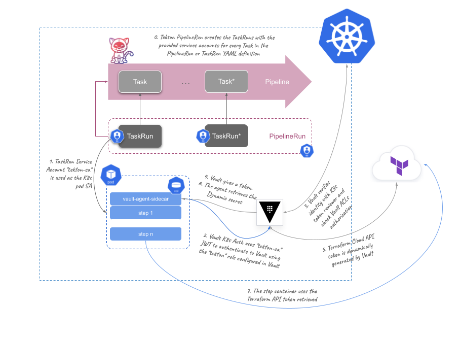

# Using HashiCorp Vault within Tekton pipelines

> Disclosure: This is not an official HashiCorp repository and it is a WIP...

[HashiCorp Vault](https://vaultproject.io) is a very well known Secrets Management solution in the the multi-cloud ecosystem. It leverages security to applications and infrastructure workflows, by providing a fully secured API enabled central secrets store and encryption. service. 

One of the most common use cases for secrets management is dealing with credentials within the CI/CD engines while building or deploying applications. In this repo we are providing a very easy example of implementing CI/CD pipeline security using [Tekton](https://tekton.dev/).

Tekton is a Cloud Native CI/CD open source solution that runs on Kubernetes using CRDs. Some modern CI/CD platforms are using Tekton pipelines core technology as the pipelines engine, based on the following principles:

* One step, one container. Every step execution is isolated at a container level
* Losely coupled pipelines by `tasks` isolation. One task instance, one pod
* Kubernetes as the platform abstraction for the automated operators

## The context

We are using the `Zero-Trust` concept to retrieve secrets into our pipelines by using HashiCorp Vault integration:

* Tekton pipeline uses Kubernetes Service Account `tekton-sa` identity to authenticate into Vault
* Vault ACL policy gives access only to the required secret mount in Vault
  ```hcl
  path "terraform/creds/*" {
    capabilities = ["read","list"]
  }
  ```
* Use HashiCorp Vault Agent as a sidecar in the pipeline to generate a Terraform Cloud API token, and inject/share within the steps in the pipeline (containers in the task pod) to use Terraform Cloud API
* Terraform API token is created dinamically by Vault with a TTL of `5m`. Vault Agent sidecar is responsible on renewing the lease if the pipeline takes longer that the TTL
* Once the Tekton pipeline finishes there is no persistent storage, so no stored tokens or leases are persisting, and all of them will be automatically revoked after the TTL in any case.

The following diagram explains at a high level how it works:



## Requirements

You just need a couple of things at no cost:

* A running Kubernetes cluster (you can use Minikube or similar locally). For a Cloud K8s you can use the free tiers.
* A Terraform Cloud active Workspace (Follow [this HashiCorp Tutorial](https://learn.hashicorp.com/collections/terraform/cloud-get-started) to quickly create a Terraform configuration in Terraform Cloud)
* [Kubectl](https://kubernetes.io/docs/tasks/tools/#kubectl) CLI tool to manage the Kubernetes cluster objects
* [Helm](https://helm.sh/docs/intro/install/) to install Vault in Kubernetes
* Some shell scripting knowledge will be helpful

> NOTE: This repository code has been tested using MacOS (Monterey) and Linux (Ubuntu Impish) in both Minikube and GKE clusters

To install and configure the environment you will need to do it from `tekton-vault` directory (root directory o this repo), so change to that directory:

```
cd ./tekton-vault
```

## Installation

Let's assume that the Kubernetes cluster is already running and that you have admin access to it (With Minikube is simple: `minikube start`)

Let's deploy Vault in Developer mode, Tekton Pipelines and Tekton Dashboard to your Kubernetes cluster. There is a script included to do this:

```bash
./00-install.sh
```

Install Tekton CLI tool:
* On MacOS:
    ```bash
    brew install tektoncd-cli
    ```
* On Linux (Debian/Ubuntu based):
    ```bash
    sudo apt update;sudo apt install -y gnupg
    sudo apt-key adv --keyserver keyserver.ubuntu.com --recv-keys 3EFE0E0A2F2F60AA
    echo "deb http://ppa.launchpad.net/tektoncd/cli/ubuntu focal main"|sudo tee /etc/apt/sources.list.d/tektoncd-ubuntu-cli.list
    sudo apt update && sudo apt install -y tektoncd-cli
    ```

## Configuring Vault and Terraform Cloud

The Tekton pipeline is going to connect to Vault using [Kubernetes Auth Method](https://www.vaultproject.io/docs/auth/kubernetes) and it is going to use the [Terraform Cloud dynamic secrets engine](https://www.vaultproject.io/docs/secrets/terraform). 

You first need to create a [Terraform Cloud User API token](https://www.terraform.io/cloud-docs/users-teams-organizations/users#api-tokens

Also , as a recommendation, you could do a `terraform login` from your terminal (Terraform CLI needed), which will create a `$HOME/.terraform.d/credentials.tfrc.json` file with your Terraform Cloud API token.

Once you have a Terraform Cloud user API token, configure Vault with the provided script:

```bash
make deploy TFEORG=<YOUR_TFC_ORG> TFEUSER=<YOUR_TFC_USER>
```

> NOTE: The previous script is basically configuring the recently deployed Vault, for the Kubernetes Auth method and the Terraform Cloud secrets engine. It does using some Terraform Cloud info needed, by automatically retrieving your Terraform Cloud user ID using a [Terraform Cloud Organization](https://www.terraform.io/cloud-docs/users-teams-organizations/organizations) and your Terraform Cloud user name. Manually would be something similar to:
>
> ```
> export TOKEN=<YOUR_TERRAFORM_CLOUD_TOKEN>
>
> export TEAMID="$(curl \
> -H "Authorization: Bearer $TOKEN" \
> -H "Content-Type: application/vnd.api+json" \
> https://app.terraform.io/api/v2/organizations/<YOUR_TFC_ORG>/teams?include=users \
> | jq -r '.data[] | select(.attributes.name == "owners") | .id')"
>
> curl \
> -H "Authorization: Bearer $TOKEN" \
> -H "Content-Type: application/vnd.api+json" \
> "https://app.terraform.io/api/v2/teams/${TEAMID}include=users" \ 
> | jq -r '.included[] | select(.attributes.username == "<YOUR_TFC_USER>") | .id'
> ```
>
> You will get an output similar to `user-1234567890abcdef`, which is the User ID to use in the Terraform Cloud secret engine config in Vault.

Verify your Vault configuration by reading the different configs done:

* Kubernetes Auth config (example terminal output is included):

    ```
    $ kubectl exec -ti vault-0 -n vault -- vault read auth/kubernetes/config
    kubectl exec -ti vault-0 -n vault -- vault read auth/kubernetes/config
    Key                       Value
    ---                       -----
    disable_iss_validation    true
    disable_local_ca_jwt      false
    issuer                    https://kubernetes.default.svc.cluster.local
    kubernetes_ca_cert        -----BEGIN CERTIFICATE-----
    ...
    ...
    ...
    -----END CERTIFICATE-----
    kubernetes_host           https://10.96.0.1:443
    pem_keys                  []
    ```

* Kubernetes Auth role (terminal output is included):

    ```
    $ kubectl exec -ti vault-0 -n vault -- vault read auth/kubernetes/role/tekton
    Key                                 Value
    ---                                 -----
    alias_name_source                   serviceaccount_uid
    bound_service_account_names         [tekton vault-auth default]
    bound_service_account_namespaces    [tekton-pipelines default]
    policies                            [tektonpol]
    token_bound_cidrs                   []
    token_explicit_max_ttl              0s
    token_max_ttl                       0s
    token_no_default_policy             false
    token_num_uses                      0
    token_period                        0s
    token_policies                      [tektonpol]
    token_ttl                           1m
    token_type                          default
    ```

* Terraform Cloud role (terminal output is included):

    ```
    $ kubectl exec -ti vault-0 -n vault -- vault read terraform/role/<YOUR_TFC_USER>
    Key        Value
    ---        -----
    max_ttl    0s
    name       <YOUR_TFC_USER>
    ttl        5m
    user_id    <YOUR_TFC_USER_ID>
    ```


## Deploy your Tekton pipelines

Running Tekton pipelines is just a matter of deploying the required CRDs objects into the Kubernetes cluster where Tekton is installed.

From main directory of this repo, execute the following in your terminal:

```
kubectl apply -f ./pipelines
```

A [Tekton Task](./pipelines/vault-tfc-task.yaml) will be deployed:

```yaml
apiVersion: tekton.dev/v1beta1
kind: Task
metadata:
  name: vault-tfc
spec:
  params:
    - name: tfc_org
      type: string
    - name: tfworkspace
      type: string

  stepTemplate:
    env:
      - name: "VAULT_ADDR"
        value: "http://vault.vault.svc.cluster.local:8200"

  steps:
    - name: vault-status
      image: gcr.io/cloud-builders/curl
      script: |
...
...
...
```

Also, a [Tekton Pipeline](./pipelines/vault-tfc-pipeline.yaml):

```yaml
apiVersion: tekton.dev/v1beta1
kind: Pipeline
metadata:
  name: vault-tfc-pipeline
spec:
  params:
    - name: tfc-workspace
      type: string
      description: Workspace Name
    - name: tfc-organization
      type: string
      description: Terraform Cloud Org
      
  tasks:
    - name: run-tfc
      taskRef:
        name: vault-tfc
      params:
        - name: tfworkspace
          value: "$(params.tfc-workspace)"
        - name: tfc_org
          value: "$(params.tfc-organization)"
```

You can use now **Tekton CLI** to check tasks and the pipelines:

* Listing tasks
```bash
tkn t list
```

* Listing pipelines
```bash
tkn p list
```

* Show your pipeline or task info:
```bash
tkn p describe vault-tfc-pipeline

tkn t describe vault-tfc
```

### Using Tekton Dashboard

You can use Tekton Dashboard UI to monitor your `Pipelines` and `Tasks` or running them by creating `TaskRuns` or `PipelineRuns` just by clicking in your browser.

Forward the Tekton Dashboard service to be able to access the UI in from your client machine:

```bash
kubectl forward svc/tekton-dashboard -n tekton-pipelines 9097:9097
```

You can check in the URL `http://localhost:9097`:


See the pipeline definition in the UI URL [http://localhost:9097/#/namespaces/default/pipelines/vault-tfc-pipeline?view=yaml](http://localhost:9097/#/namespaces/default/pipelines/vault-tfc-pipeline?view=yaml) (or by clicking in `Pipelines Menu > YAML Tab`):


## Run your pipeline

To run the pipeline by CLI, use Tekton CLI and passing the right parameters:
```bash
tkn p start \
-s tekton-sa \
-p tfc-organization=<YOUR_TFC_ORG> \
-p tfc-workspace=<YOUR_TFC_WORKSPACE>
```

You can see the last `TaskRun` log by command line (terminal output included):
```
$ tkn tr logs -f -L
[vault-status] Vault Address is http://http://vault.vault.svc.cluster.local:8200
[vault-status]
[vault-status]
[vault-status] {"type":"shamir","initialized":true,"sealed":false,"t":1,"n":1,"progress":0,"nonce":"","version":"1.9.0","migration":false,"cluster_name":"vault-cluster-9cf4fbdb","cluster_id":"42fe4944-3d2c-b5e8-44c8-06edc447b583","recovery_seal":false,"storage_type":"inmem"}

[tfc-workspace] Saving the Workspace ID in a file
...
...

[run-json] Creating the payload to run the Terraform Workspace
[run-json]
[run-json]
[run-json] {
[run-json]   "data":{
[run-json]     "attributes":{
[run-json]       "is-destroy": false,
[run-json]       "message": "API Apply from Tekton: vault-tfc-run-1643276397335-r-q4ngn-pod 🎉 🍻 "
...
...

[tfc-run]   % Total    % Received % Xferd  Average Speed   Time    Time     Time  Current
[tfc-run]                                  Dload  Upload   Total   Spent    Left  Speed
100  2403    0  2082  100   321   1885    290  0:00:01  0:00:01 --:--:--  2174
[tfc-run] {"data":{"id":"run-3cqX9k5hqUBGaPwv","type":"runs","attributes":{"actions":{"is-cancelable":true,"is-confirmable":false,
...

[sidecar-agent] ==> Vault agent started! Log data will stream in below:
[sidecar-agent]
[sidecar-agent] ==> Vault agent configuration:
[sidecar-agent]
[sidecar-agent]                      Cgo: disabled
[sidecar-agent]                Log Level: debug
[sidecar-agent]                  Version: Vault v1.9.2
[sidecar-agent]              Version Sha: f4c6d873e2767c0d6853b5d9ffc77b0d297bfbdf
[sidecar-agent]
[sidecar-agent] 2022-01-27T09:48:00.087Z [INFO]  sink.file: creating file sink
...
...
[sidecar-agent] ==> Vault agent shutdown triggered
[sidecar-agent] 2022-01-27T09:48:12.340Z [INFO]  sink.server: sink server stopped
[sidecar-agent] 2022-01-27T09:48:12.340Z [INFO] (runner) stopping
...
[sidecar-agent] 2022-01-27T09:48:12.340Z [INFO] (runner) received finish

```

Also, `PipelineRuns` and `TaskRuns` executions can be listed after all your runs (example output shown):

```
$ tkn tr list
NAME                                                   STARTED        DURATION     STATUS
vault-tfc-run-1643276397335-r-q4ngn                    1 hour ago     20 seconds   Succeeded
vault-tfc-run-1643276397335-r-dsgf5                    2 hours ago    19 seconds   Succeeded
vault-tfc-run-1643276397335-r-9t4sz                    2 hours ago    17 seconds   Succeeded
vault-tfc-run-1643276397335                            2 hours ago    13 seconds   Succeeded
vault-tfc-pipeline-run-1643276014888-run-tfc           2 hours ago    13 seconds   Succeeded
vault-tfc-run-95xkh                                    12 hours ago   14 seconds   Succeeded
vault-tfc-run-s8824                                    13 hours ago   14 seconds   Succeeded
vault-tfc-run-nq86s                                    13 hours ago   15 seconds   Succeeded
vault-tfc-pipeline-run-1643221571995-r-7qqqq-run-tfc   17 hours ago   15 seconds   Succeeded

$ tkn pr list
NAME                                           STARTED        DURATION     STATUS
vault-tfc-pipeline-run-1643276014888           2 hours ago    13 seconds   Succeeded
vault-tfc-pipeline-run-1643221571995-r-7qqqq   17 hours ago   15 seconds   Succeeded
vault-tfc-pipeline-run-1643221571995           17 hours ago   15 seconds   Succeeded
tfc-workshop-run-1643115662472                 1 day ago      12 seconds   Succeeded
tfc-workshop-run-1643078323915-r-ssjzr         2 days ago     11 seconds   Succeeded
tfc-workshop-run-1643078323915                 2 days ago     13 seconds   Succeeded
```

### Running using the Tekton UI

By using the Tekton Dashboard you can also run your `Pipelines` or `Tasks`. By going into `PipelineRuns > Create` a `PipelineRun` is created with the parameter values inserted in the page fields, as well as the service account to use :


And also all logs can be followed in the Tekton UI:


## Cleaning your environment

You can use the UI to delete Tekton objects, but you can use the CLI with the following commands:

```
tkn tr rm --all

tkn t rm --all

tkn p rm --all

tkn pr rm --all
```


